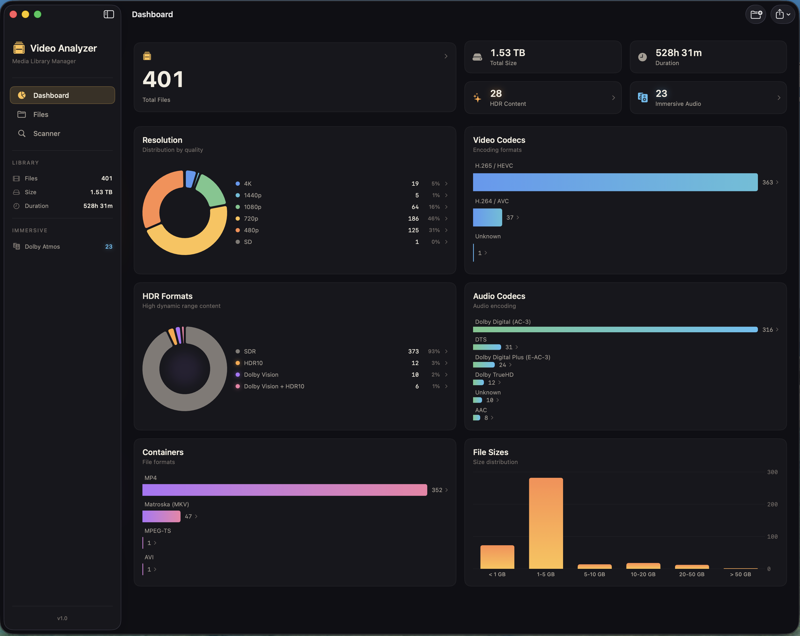
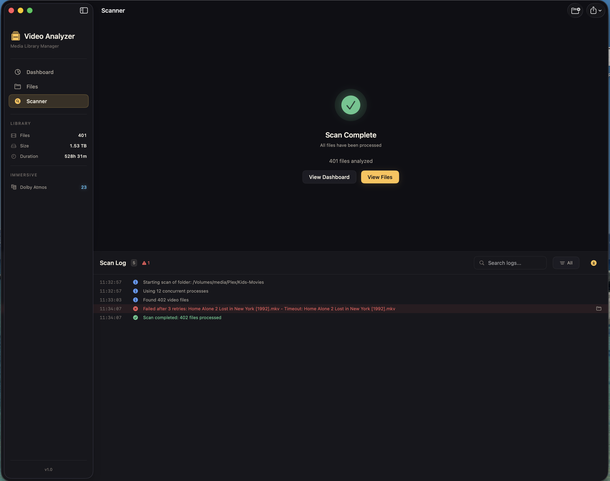

# Media Folder Visualizer

A native macOS application for scanning and analyzing video file libraries. Get comprehensive metadata, statistics, and insights about your video collection with a beautiful, premium interface.


## Screenshots

### Dashboard
Interactive dashboard with clickable metrics and charts. Click any statistic to filter your library.



### File Browser
Browse your video library with powerful filtering options. Quick filter bar provides one-click access to common filters.


### Scanner
High-performance scanning with real-time progress tracking. Clickable error logs help troubleshoot problematic files.



## Features

### Premium Media Vault Interface
- **Cinematic dark theme** with warm amber accents
- **Quality Gradient** - Premium content (HDR, Dolby Vision, Atmos) visually glows
- **Interactive dashboard** - Click any metric or chart to filter your library
- **Quick filter bar** - Fast access to common filters (4K, Dolby Vision, Atmos)

### Scanning Engine
- **High-performance scanning** - Processes 12 files concurrently using Swift Actors
- **Pause/Resume** - Stop and continue scans at any time
- **Crash recovery** - Automatic checkpoint saves every 10 seconds; resume interrupted scans on relaunch
- **Smart retry logic** - Exponential backoff for transient failures on network volumes
- **Clickable error logs** - Click failed file errors to reveal them in Finder

### Metadata Extraction
- **Video**: Codec (H.264, H.265/HEVC, VP9, AV1, etc.), resolution, bitrate, frame rate, bit depth
- **HDR**: Dolby Vision, HDR10, HDR10+, HLG detection
- **Audio**: Codec (AAC, AC3, EAC3, DTS, TrueHD, etc.), channels, Dolby Atmos, DTS:X detection
- **Container**: MKV, MP4, MOV, AVI, WebM, and more

### Interactive Dashboard
- **Clickable metrics** - Click HDR Content or Immersive Audio to see those files
- **Clickable charts** - Click any legend item to filter (e.g., click "4K" to see all 4K files)
- Resolution distribution with donut chart
- Video codec breakdown with gradient bars
- HDR format statistics with glow effects for premium formats
- Audio codec distribution
- Immersive audio (Atmos/DTS:X) tracking with luminous badges
- Total library size and duration

### File Browser
- **Quick filter bar** - One-click filters for 4K, Dolby Vision, HDR10, Atmos, DTS:X
- **Multi-select filters** - Combine multiple resolutions, formats, and codecs
- **Click-to-sort columns** - Click any column header to sort; click again to reverse
- **Resizable columns** - Drag column dividers to adjust width
- **Click-to-reveal** - Click any file row to reveal it in Finder with the file selected
- Quick search across all files
- Context menu: Reveal in Finder, Open with default app, Copy path/filename

### Additional Tools
- **Export** - CSV, JSON, or PDF reports
- **Integrity Check** - Full decode test to detect corrupted files
- **Duplicate Detection** - Find duplicates by exact hash, partial hash, or fuzzy matching

## Requirements

- macOS 14.0 (Sonoma) or later
- ffprobe is bundled with the app (no additional installation required)

## Installation

### Download
Download the latest DMG from the [Releases](../../releases) page.

### Build from Source
```bash
git clone https://github.com/bytePatrol/Media_Folder_Visualizer.git
cd Media_Folder_Visualizer
open VideoAnalyzer.xcodeproj
```

Build and run in Xcode (Cmd+R), or create a release build:
```bash
xcodebuild -project VideoAnalyzer.xcodeproj -scheme VideoAnalyzer -configuration Release
```

## Usage

1. **Start a scan**: Click the folder icon in the toolbar or use File → New Scan (Cmd+N)
2. **Browse files**: Switch to the Files tab to see all scanned videos
3. **Filter quickly**: Use the quick filter bar for common filters (4K, HDR, Atmos)
4. **Click to explore**: Click dashboard metrics or chart legends to filter your library
5. **View statistics**: The Dashboard shows charts and metrics for your library
6. **Export data**: Use File → Export to save as CSV, JSON, or PDF

### Keyboard Shortcuts

| Action | Shortcut |
|--------|----------|
| New Scan | Cmd+N |
| Export | Cmd+E |
| Pause/Resume Scan | Cmd+Shift+P |
| Cancel Scan | Cmd+. |
| Show Dashboard | Cmd+1 |
| Show Files | Cmd+2 |
| Show Scanner | Cmd+3 |

## Technical Details

### Architecture
- **SwiftUI** for the user interface
- **Swift Actors** for thread-safe concurrent scanning
- **GRDB.swift** with SQLite WAL mode for the database
- **Swift Charts** for dashboard visualizations
- **Combine** for reactive data flow

### Design System
The app uses a comprehensive design system with:
- **VaultColors**: Surface colors, text hierarchy (celluloid tones), accents
- **VaultSpacing**: Consistent spacing scale from 2px to 48px
- **VaultTypography**: Display, headline, body, caption, and monospace styles
- **VaultRadius**: Border radius scale (4px to 16px)
- **Reusable components**: VaultCard, VaultBadge, VaultMetric, VaultProgressRing, VaultFilterChip

### Performance
- Batch database inserts (50 files at a time)
- Throttled UI updates during scanning
- View recycling for large file lists
- Optimized ffprobe parameters for fast metadata extraction

## Project Structure

```
VideoAnalyzer/
├── App/                    # App entry point, delegate, AppState
├── Models/                 # Data models, enums
├── Views/
│   ├── DesignSystem.swift  # Design tokens and reusable components
│   ├── Dashboard/          # Charts and statistics
│   ├── FileList/           # File browser table, filters
│   ├── Scanner/            # Scan progress and logs
│   └── Settings/           # Preferences
├── Services/
│   ├── Scanning/           # ScanEngine, FFProbeRunner, MetadataParser
│   ├── Database/           # DatabaseManager, VideoFileRepository
│   ├── Recovery/           # Checkpoint and crash recovery
│   └── Export/             # CSV, JSON, PDF export
└── Resources/              # Assets, bundled binaries
```

## Contributing

Contributions are welcome! Please feel free to submit a Pull Request.

1. Fork the repository
2. Create your feature branch (`git checkout -b feature/amazing-feature`)
3. Commit your changes (`git commit -m 'Add amazing feature'`)
4. Push to the branch (`git push origin feature/amazing-feature`)
5. Open a Pull Request

See [CONTRIBUTING.md](CONTRIBUTING.md) for detailed guidelines.

## License

This project is licensed under the MIT License - see the [LICENSE](LICENSE) file for details.

## Acknowledgments

- [ffmpeg/ffprobe](https://ffmpeg.org/) for video metadata extraction
- [GRDB.swift](https://github.com/groue/GRDB.swift) for SQLite database management
